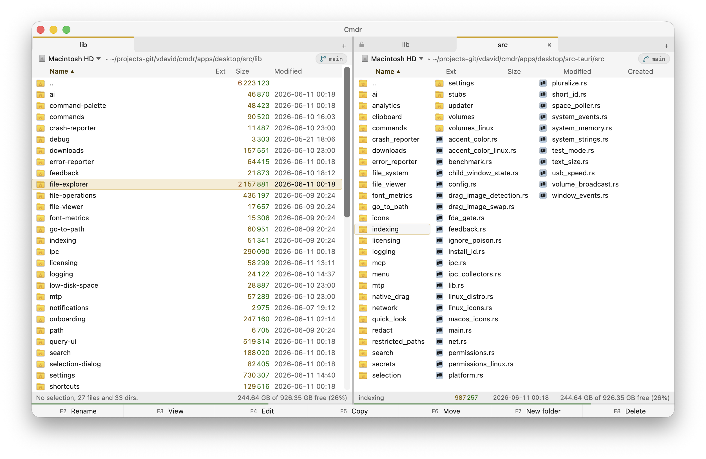

# Cmdr


An extremely fast, keyboard-driven two-pane file manager for macOS, written in Rust. Source-available, free forever for
personal use. With fully optional, privacy-first AI features.

Cmdr is for folks who love a rock-solid, keyboard-driven, two-pane file manager with a modern UI in 2026. Like Total
Commander, but on macOS.

Give it a try: [download for macOS](https://getcmdr.com), or install with Homebrew:

```bash
brew tap vdavid/tap && brew trust --cask vdavid/tap/cmdr && brew install --cask cmdr
```

The `brew trust` step is new in Homebrew 6: it asks you to okay any third-party tap once before it runs. Cmdr's tap is
one of those for now.

**Note:** If you'd love a nice short `brew install --cask cmdr`, **star** this repo! Once it hits 225 stars, Homebrew
lets it into its main tap.

<picture>
  <source media="(prefers-color-scheme: dark)" srcset="brand/screenshots/app-main-dark.png" />
  
</picture>

## Overview

I (David, the dev) loved Total Commander on Windows, used it for 20+ years. Then I switched to macOS, and my biggest
pain point about the OS was a fast, rock-solid, and pleasant file manager. Cmdr intends to fix this.

Then there is AI. With LLMs, some really cool features became possible that never were. I'm experimenting with adding
these features gradually. But the intention is that AI features remain fully **optional**. With AI features off, you've
got a Total Commander-like experience. With it, you get natural-language search and smart selection, with smart renaming
and (human-approved!) auto-organization coming soon. AI features are local-by-default, so no files or other data leave
your Mac.

Core features:

- **Two-pane layout**: see two folders side by side.
- **Keyboard-first**: do anything without touching your mouse, using your familiar shortcuts.
- **Blazing fast file operations**: copy, move, rename, and delete with a few keystrokes.
- **Optional, privacy-first AI**: search and select with natural language, all on your Mac.
- **Easy on the eyes**: real dark and light modes, and every text color is verified against both WCAG 2.2 AA and APCA,
  the modern perceptual contrast method, so nothing falls below APCA Lc 45.

## Installation

Download it from [getcmdr.com](https://getcmdr.com), or install with Homebrew:

```bash
brew tap vdavid/tap && brew trust --cask vdavid/tap/cmdr && brew install --cask cmdr
```

The `brew trust` step is Homebrew 6's new safety gate: it has you okay a third-party tap once before it runs any code. A
star, watch, or fork on [the repo](https://github.com/vdavid/cmdr) helps Cmdr reach Homebrew's notability bar (225
stars), which unlocks a tap-free, trust-free `brew install --cask cmdr`.

Windows and Linux users: sorry, you'll need to wait. The Rust+Tauri stack allows for cross-platform deployment, but the
app uses OS-specific features by nature, so I've only had time to write and test it on macOS for now.

## Usage

Launch Cmdr and start navigating:

| Key     | Action               |
| ------- | -------------------- |
| `Tab`   | Switch between panes |
| `↑` `↓` | Navigate files       |
| `Enter` | Open file/folder     |
| `F5`    | Copy                 |
| `F6`    | Move                 |
| `F7`    | Create folder        |
| `F8`    | Delete               |

## Tech stack

Cmdr is built with **Rust** and **Tauri** for the backend, and **Svelte** with **TypeScript** for the frontend. This
gives it native performance with a modern, responsive UI.

## License

Cmdr is **source-available** under the [Business Source License 1.1](LICENSE).

### Free for personal use

Use Cmdr for free on any number of machines for personal, non-commercial projects. No nags, no trial timers, no
restrictions.

### Commercial use

For work projects, you'll need a license:

- **$59/year**: subscription, auto-renews
- **$199 one-time**: perpetual license

Purchase at [getcmdr.com/pricing](https://getcmdr.com/pricing).

### OpenAI Build Week submission

For OpenAI Build Week, I worked with Codex to build a natural-language bulk-rename feature incl. renaming images based
on their content, and a UI for humans to review and apply the rename suggestions. I worked in one long, continuous
session, mainly using Terra (high) and some Sol (medium), from feature planning through
[PR #39](https://github.com/vdavid/cmdr/pull/39). I brought my existing codebase and guardrails, picked the scope, the
plan review process, the UX direction, and what to accept during manual QA. Codex turned those decisions into the
spec/pland then the impl. It delegated plan reviews, translations, and pieces of the implementation to subagents,
diagnosed failures from logs, wrote tests, then prepared the PR and docs. The bulk of the submission-window work is the
natural-language bulk rename feature, but it also needed an MCP extension, a tweak to add an OpenAI-compatible provider,
streaming-state, copyability, localization, and operation-safety changes in the PR, so it came out pretty complex. Mind
that Codex did not build the rest of Cmdr itself: the file manager, the built-in chat, image index, MCP infra, and ops
engine all existed before Build Week. The evidence and collaboration record are in
[docs/hackathon-submission.md](docs/hackathon-submission.md).

To run the submission without building from source, download Cmdr v0.35.0 from [getcmdr.com](https://getcmdr.com),
configure an AI provider, open a folder or select files, and ask Cmdr to rename them. Review the proposed rows, change
the Allow/Deny choices, and apply the accepted subset; use disposable files for evaluation. The exact submitted code,
scope, and validation record are in [PR #39](https://github.com/vdavid/cmdr/pull/39).

### Source code

The source becomes [AGPL-3.0](https://www.gnu.org/licenses/agpl-3.0.html) after 3 years (rolling per release). Until
then, you can view, modify, and learn from the code, but not use it commercially without a license.

---

## Contributing

Contributions are welcome! Report issues and feature requests in the
[issue tracker](https://github.com/vdavid/cmdr/issues).

By submitting a contribution, you agree to license your contribution under the same terms as the project (BSL 1.1,
converting to AGPL-3.0) and grant the project owner the right to use your contribution under any commercial license
offered for this project.

Happy browsing!

David
