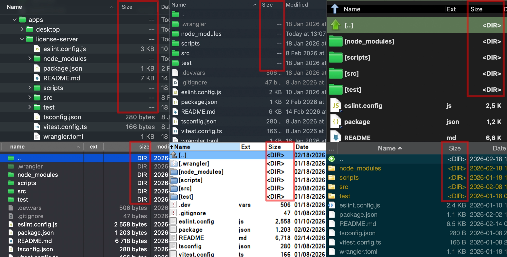

Last night around 1 am—as you do—I was thinking about displaying dir sizes.

First I thought I'd just do what all file managers do and only measure one at a time, and only on request.

Then I wondered: "what if I used a file watcher to keep the results live?" And then it came to me: hey, what if I
scanned the _entire drive_ on startup, and then watched for changes? Then we'd have a live index of the whole file
system, sitting in memory or a small DB.

I thought there _obviously_ had to be some technical limitations that prevent this. But I asked the robots anyway
whether we could do it, and waited for the results half-asleep. Then they came back saying _yessir, we can actually
do this!_

<!-- more -->

## Why I'm so excited

There are currently three features missing from the Cmdr MVP: **delete**, **tabs**, and **showing dir sizes**. So I was
thinking about dir sizes. I'm leaving delete for last because, you know, I want to make the app super safe before I let
it delete my files. 😬

So anyway, dir sizes. If you've ever used a two-pane file manager (or even just Finder), you know the pain: all the
"size" column says for folders is `<DIR>` or `--`, and you have no idea if a folder is 5 MB or 50 GB until you press
some keys or right-click and wait a bunch.

But then, it's 2026! Can we do better? Turns out we can!

You only need to scan once and watch—the OS provides all the tools. It doesn't even take that long: a few minutes of
scanning, once. The app works during the scan. It even prioritizes your current dir and your selections, while running
the full scan in the background. It's fast, takes almost no CPU, next to no battery, and I'll use a small DB, so it
won't even take up much RAM.

Then, with the live index, Cmdr can show directory sizes _everywhere_, _all the time_, and they're _always up to date_.
The realization that this is possible already gave me goosebumps. But then I realized what else this unlocks:

- **Instant search across your entire drive.** No waiting for a search from scratch or Spotlight. Just type what you
  need and find your files, pretty much immediately.
- [GrandPerspective](https://grandperspectiv.sourceforge.net/)-style **treemap visualizations** so you can see what's
  eating up space in any folder, right inside Cmdr.

No need for separate search apps anymore. No need for a separate disk visualization tool either. It'll be all built in!

And the best bonus that I wasn't even hoping for: apparently, this might even work on **network drives** (SMB shares)
too!

## Why doesn't everyone do this?

Good question. A few reasons I think:

- **Most file managers rely on Spotlight** for search. But Spotlight doesn't index hidden files, app contents, or system
  dirs. And some people (me included) have it turned off entirely because it hogs resources.
- **It's a bit tricky to implement.** You need to scan the drive _and_ start watching for changes at the same time, then
  reconcile the two. It's not rocket science, but it's not trivial either, and you need to get the edge cases right.
- **There are dedicated apps for this.** I found [Cardinal](https://github.com/cardisoft/cardinal),
  [Cling](https://lowtechguys.com/cling/), and [KatSearch](https://sveinbjorn.org/katsearch). They're probably great
  search tools, but I've never used them. I prefer not running another app to search for files when my file manager is
  always open anyway. I want this built in!

## The numbers

I have about 1.8 million files on my Mac and another 1.2 million on my NAS. That's 3 million files total. I just
counted. So here's what I expect:

- **Initial scan:** ~2–3 minutes in the background for my main drive, then probably like 10 minutes for the NAS. I can
  use Cmdr normally while it's running. Scanning takes one CPU core, which is fine. Battery-wise, it's nothing.
- **Storage:** the SQLite index will probably be around 1–2 GB on disk. Not in RAM. On disk. Memory footprint stays
  small, and that disk space is well worth it. You'll be able to turn it off if you disagree anyway.
- **File watching:** It's a free lunch. The app only subscribes to events that the OS already fires.

## What's next

Today I built this blog engine to post about it. Tomorrow I'm building the feature! I'll add the scanning and live dir
sizes. Search will probably be a follow-up after the MVP, then the treemap viz a bit later.

Honestly, I've been excited about several Cmdr features (the built-in MCP server was one of them), but I think this one
is what I'm most pumped about so far!
