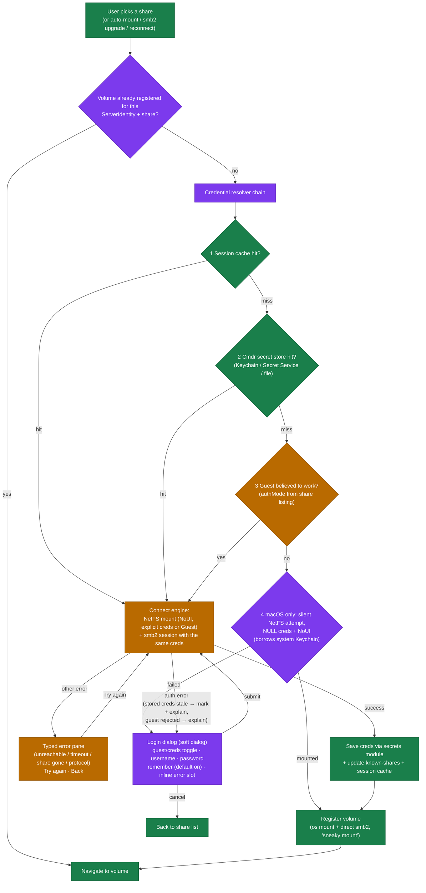
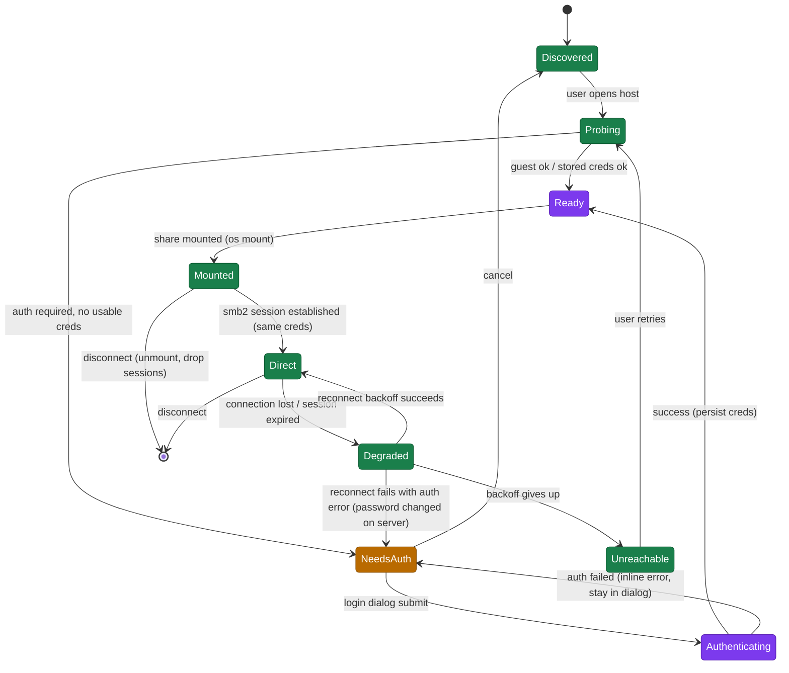

# SMB auth flow: incident analysis and UX redesign proposal

Status: P0 implemented (2026-06-06); P1/P2 are proposals. Written 2026-06-06 after a real-world dead-end login flow on
the `Naspolya` NAS. Owner doc for the planned login/connect lifecycle rework (SMB now, S3/FTP/WebDAV later).

## The incident

What David saw: Network > Naspolya > naspi → a **macOS system dialog** ("You entered an invalid username or password for
the server 192.168.1.111") → Cmdr's error pane ("Couldn't mount share – Mount failed with error code -6600") → "Try
again" loops forever. At no point did Cmdr offer a credential prompt. Complete dead end.

### Timeline (from `cmdr.log`, worktree instance `progressive-scan-sizes`, 2026-06-06 16:15–16:19)

1. **16:15:21** App start. macOS had auto-mounted `naspi` at `/Volumes/naspi` (Finder creds, saved in the **system**
   Keychain). Cmdr registered it as an os-mount volume (`smb-naspolya-smb-tcp-local-445-naspi`,
   `smbConnectionState: os_mount`).
2. **16:15:22** Startup smb2 upgrade: Cmdr's own secret store has no creds for Naspolya (dev runs `PlainFileStore` via
   `CMDR_SECRET_STORE=file`, so even creds saved in a prod Cmdr session are invisible here) → guest attempt →
   `STATUS_LOGON_FAILURE` → silently stayed `LocalPosixVolume`. Fine so far.
3. **16:16:54** User opens Network > Naspolya. Share listing: guest smb2 fails (auth) → Cmdr secret store: no creds →
   `smbutil view -N` fallback succeeds **using the system Keychain** → 8 shares, `authMode: CredsRequired`. The UI
   renders the share list as if everything is fine, but `authenticatedCredentials` stays `null` (`ShareBrowser.svelte`):
   Cmdr knows auth is required and holds no credentials, and tells the user nothing.
4. **16:16:57** User selects `naspi`. `disambiguated_mount_path` compares the mount target server (`192.168.1.111`, we
   prefer IP) against `statfs`'s server for the existing `/Volumes/naspi` (`Naspolya._smb._tcp.local`) by **string
   equality** → mismatch → "taken by another server" → picks `/Volumes/naspi-1` and sets `ForceNewSession`.
5. `mountNetworkShare(server, share, null, null, …)` → `want_guest = true` → NetFS `Guest` key. `ForceNewSession`
   prevents NetFS from riding the existing authenticated kernel session. The server rejects guest. Because Cmdr never
   sets `kNAUIOptionNoUI`, NetFS hands the failure to **NetAuthAgent, which shows the system dialog**. User clicks OK →
   `NetFSMountURLSync` returns **-6600 = `kNetAuthErrorInternal`** (documented in `NetFS.h`) → our `error_from_code`
   catch-all → `ProtocolError: "Mount failed with error code -6600"`.
6. **16:17–16:19** "Try again" repeats the identical guest attempt (same `null` creds stored in `lastMountAttempt`). The
   final attempt hits the 20 s mount timeout while the NetAuthAgent dialog sits open (the timeout abandons the
   `spawn_blocking` task but can't cancel NetFS).

### Root causes, ranked by user pain

1. **Server identity is compared as strings.** The same NAS is known as `Naspolya._smb._tcp.local`, `Naspolya.local`,
   and `192.168.1.111`; the disambiguation logic treats these as different servers, forcing a doomed second mount + new
   session. Where: `mount.rs::disambiguated_mount_path`
2. **No already-mounted short-circuit.** The share the user picked was already mounted AND registered as a Cmdr volume.
   Selecting it should navigate, not mount again. Where: `NetworkMountView.svelte::handleShareSelect`
3. **Mount goes out as guest even when we know creds are required.** `authMode: CredsRequired` is in hand; credentials
   are `null`; we attempt guest anyway instead of prompting first. Where: `ShareBrowser.svelte` →
   `NetworkMountView.svelte`
4. **System auth UI is not suppressed.** We never set `kNAUIOptionNoUI`, so NetAuthAgent can pop non-Cmdr dialogs on
   auth failure (and could even pop credential prompts in other code paths). Where: `mount.rs::mount_share_sync` (open
   options)
5. **Mount-phase auth failure is a dead end.** The error pane offers Try again (same creds) and Back; nothing routes to
   the login form. Share-listing auth failures DO route there; mount failures don't. Where: `NetworkMountView.svelte`
   error state
6. **NetAuth error codes are unmapped.** -6600 (`kNetAuthErrorInternal`), -6602 (`kNetAuthErrorMountFailed`), -6004
   (`kNetAuthErrorGuestNotSupported`) all fall into the opaque `ProtocolError` catch-all. Where:
   `mount.rs::error_from_code`
7. **Split-brain credential stores.** Share listing can succeed via the system Keychain (`smbutil -N`) while Cmdr's own
   store is empty, so the UI looks authenticated but Cmdr can't actually authenticate anything itself (smb2, NetFS
   mount). Where: `smb_client.rs::list_shares_smb2` (Keychain fallback) vs `keychain.rs`/`secrets`

Cause 7 is what makes this hit real users, not just dev: anyone whose NAS creds live in the system Keychain (saved by
Finder) gets the "shares list fine, mount dead-ends" combination.

## What should happen: the target flow

Principles, in line with the app's top-5:

- **Cmdr owns all auth UI.** The OS never shows a dialog (`kNAUIOptionNoUI` on macOS; never let `gio mount` prompt on
  Linux). Every error becomes a typed state we render ourselves.
- **One credential resolver, one connect engine.** Listing, mounting, the smb2 session, and reconnect all draw
  credentials from the same ordered chain and report auth failures into the same loop. No path may fail auth without
  offering the login dialog.
- **Identity, not strings.** A server is a `ServerIdentity` (mDNS service name + hostname + IP + port) with an
  equivalence check that consults the discovery state. Keychain keys, volume ids, disambiguation, and known-shares all
  go through it.
- **Login is a soft dialog, not an in-pane form.** It can be summoned from anywhere (share browser, mount failure,
  reconnect, smb2 upgrade, future S3/FTP), shows protocol-specific fields from a descriptor, and leaves the pane in a
  calm "waiting for sign-in" state behind it.

### Connect flow (proposed)

Color legend: 🟩 green = existing, keep as is · 🟧 orange = existing, needs modification · 🟪 purple = new.



Notes on the boxes:

- **Registered-volume short-circuit** (🟪): kills incident cause 2. The lookup key is `ServerIdentity` + share name, so
  `192.168.1.111` finds the volume that `statfs` knows as `Naspolya._smb._tcp.local`. The existing
  `resolve_server_address` / `friendly_server_name` helpers in `smb_upgrade.rs` already do most of this resolution; they
  become methods on `ServerIdentity`.
- **Credential resolver** (🟪): today steps 1–2 exist (`CREDENTIAL_CACHE`, `keychain.rs` → `secrets`), but each caller
  (share listing, mount view, upgrade, reconnect) composes them differently. The resolver makes the order and the
  fallbacks one piece of code with one outcome type: `Creds { value, provenance }` or `NeedUser`.
- **Step 4, the silent system-Keychain borrow** (🟪): NetFS with `NULL` creds + `NoUI` either silently mounts using
  Finder-saved creds or fails without any dialog. This converts incident cause 7 from a dead end into a silent success
  for the os-mount path. The smb2 direct session still has no creds in that case: the volume runs as os-mount with the
  existing "Connect directly" upgrade indicator, which routes to the same login dialog when clicked. (We deliberately
  don't read the system Keychain item ourselves; that's possible via the Security framework but costs a scary consent
  prompt per item. Can revisit.)
- **Connect engine** (🟧): mostly today's `mount_share` + `register_smb_volume`, but with `kNAUIOptionNoUI` always set,
  NetAuth codes mapped (-6600 → `AuthFailed`, -6004 → `AuthRequired`), identity-aware disambiguation, and one shared
  auth-error contract that both NetFS and smb2 failures classify into.
- **Login dialog** (🟪): replaces the in-pane `NetworkLoginForm` placement (the form component itself is largely
  reusable). Soft dialog via the existing dialog manager. Carries: server display name, optional share name, guest
  toggle (only when `authMode === 'guest_allowed'`), username (pre-filled from `known_shares` hints), password,
  "Remember this password" (default on), and an inline error slot ("That password didn't work for naspolya").

### Connection lifecycle (per server, proposed)



Existing pieces that already implement parts of this: `SmbConnectionState` (`Disconnected | Direct`, in
`volume/backends/smb.rs`), the FE `smb-reconnect-manager` backoff cycle, `SmbReconnectingView`,
`VolumeUnreachableBanner`, and `known_shares.rs`. The proposal is to name the missing states (`NeedsAuth`,
`Authenticating`, `Ready`) and route ALL auth failures, including `Degraded → reauth`, into the same login dialog. The
"password changed on the NAS" case today silently exhausts the backoff and shows "unreachable", which is a lie; with the
`Degraded → NeedsAuth` edge it says "Sign in to reconnect".

Lifecycle controls the user gets (context menu on host/volume, plus dialog buttons):

- **Disconnect**: unmount all shares of the server + drop smb2 sessions (`unmount_smb_shares_from_host` +
  `disconnect_smb_volume` exist).
- **Forget saved password**: exists (`deleteSmbCredentials`); add it to the login dialog too ("signing in with different
  credentials replaces the saved ones").
- **Sign in as…**: open the login dialog pre-filled, even when the current session works (replaces creds on success).

## Generalizing beyond SMB (S3, FTP, WebDAV…)

The dialog and resolver shouldn't know SMB. Proposed seam: a `ConnectionProvider` descriptor per protocol:

```text
ConnectionProvider {
    id: "smb" | "s3" | "ftp" | …,
    credentialFields: [ { key, label, kind: text|password|select|checkbox, optional, … } ],
    supportsGuest: bool,             // SMB, FTP-anonymous: yes; S3: no
    secretAccountKey(identity, scope) -> String,   // "smb://naspolya/naspi", "s3://bucket@endpoint"
    probe(identity) -> AuthMode,
    connect(identity, creds) -> Volume(s),
}
```

- SMB fields: username, password, (domain under "Advanced"). S3: access key, secret key, region/endpoint. FTP: username,
  password, anonymous toggle.
- The soft dialog renders from `credentialFields`; the resolver chain (cache → secret store → guest → prompt) is
  protocol-agnostic; only `probe`/`connect` are per-protocol.
- Storage stays on the existing `secrets` module, which already abstracts macOS Keychain / Linux Secret Service /
  encrypted file, so Linux needs no new credential work. The account-key convention generalizes the current
  `smb://{server}/{share}` format.
- Linux mount parity: `gio mount` must never be allowed to prompt (feed it creds non-interactively, treat a prompt
  request as `AuthRequired`), mirroring `NoUI`.

## The smb/smb2 divide

Keep the two paths (os mount for Finder/Terminal compatibility, smb2 direct for speed) but make credentials flow once:

- The connect engine acquires creds, then uses them for BOTH the NetFS mount and the smb2 session in the same operation
  (today's "sneaky mount", minus the second independent guest probe that produced the `STATUS_LOGON_FAILURE` noise in
  the log).
- The smb2 upgrade paths (startup, mount-watcher, manual) become consumers of the resolver instead of doing their own
  keychain-or-guest dance. When the resolver says `NeedUser`, fire-and-forget paths stay silent (volume remains os-mount
  with the upgrade indicator); user-initiated paths open the login dialog.
- The system-Keychain borrow (step 4) is the one asymmetry: it can authenticate the os-mount but not smb2. That's
  acceptable; the volume works, and the upgrade indicator offers the sign-in that unlocks direct mode.

## Suggested work breakdown

**P0 – stop the bleeding (each small, independently shippable). DONE, all five:**

1. Always set `kNAUIOptionNoUI` in `mount_share_sync` open options (`open_option_entries`). No system dialog, ever.
2. Map NetAuth codes in `error_from_code`: -6600 → `AuthFailed`, -6004 → `AuthRequired`, -6003 → `ShareNotFound`. (-6602
   `kNetAuthErrorMountFailed` deliberately stays `ProtocolError` with a readable message: it means auth SUCCEEDED and
   the mount step failed, so routing it to the login form would loop the user pointlessly.)
3. Mount-phase `AuthFailed`/`AuthRequired` routes to the login form instead of the dead-end error pane
   (`NetworkMountView`); retry mounts with the entered creds and saves on success.
4. Don't attempt guest mounts when `authMode === 'creds_required'` and we hold no creds; prompt first
   (`ShareBrowser::activateShare`).
5. Identity-aware disambiguation + already-mounted short-circuit (`network/server_identity.rs`).

**P1 – the redesign:** `ServerIdentity`, credential resolver, connect engine, soft login dialog, lifecycle states
(`NeedsAuth`/`Authenticating`, the `Degraded → NeedsAuth` reauth edge), silent system-Keychain borrow.

**P2 – generalization:** `ConnectionProvider` seam, S3/FTP, Linux `gio` non-interactive parity, optional system-
Keychain import via the Security framework.

## Reference: facts established during the investigation

- `-6600` is `kNetAuthErrorInternal`, documented in the public `NetFS.h` (Xcode SDK), alongside `kNAUIOptionKey` /
  `kNAUIOptionNoUI` (`CFSTR("UIOption")` / `CFSTR("NoUI")`).
- The "invalid username or password" dialog is NetAuthAgent's, triggered because we leave `UIOption` unset (defaults to
  allowing UI). Cmdr's explicit-creds/Guest strategy avoids the _Keychain-lookup_ prompt but not the _auth-failure_ UI.
- `smbutil view -N` authenticates from the **system** Keychain, which Cmdr can use for listing but not for NetFS (we
  suppress the lookup with the Guest key) nor for smb2 (we can't read the secret).
- Dev instances run `CMDR_SECRET_STORE=file` (set by `tauri-wrapper.ts`), so credentials saved in prod Cmdr or by Finder
  are never visible to a dev session's own store. Any dev test of this flow starts credential-less by design.
