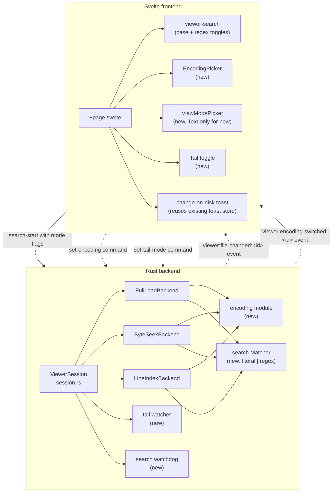

# Viewer enhancements: regex search, encoding picker, tail mode — plan

Three independent additions to the file viewer, landing in this order:

1. **Regex search** with explicit case-sensitivity toggle (default: case-sensitive). Hard <1 s cancellation guarantee
   via per-match cancel + watchdog.
2. **Encoding picker** in a Commander One-style overlay toolbar at the top of the viewer window. Supports UTF-8 (with
   and without BOM), Windows-1252, ISO-8859-1, Mac Roman, US-ASCII, UTF-16 LE, and UTF-16 BE. Includes BOM detection
   plus a heuristic fallback for files with no BOM. Switching encodings on an open 5 GB file stays interactive.
3. **Tail mode** plus always-on external-change toast. Toggle is off by default; the always-on watcher surfaces a
   non-disappearing toast when the file changes on disk.

All three are scoped to the local-file viewer (no MTP / SMB support — the viewer is local-only today, see
`session.rs:open_session`).

## Required reading for anyone touching this work

Read in full before writing or reviewing code on this task:

- [`/AGENTS.md`](../../AGENTS.md) — repo-wide rules, critical-rules section, workflow. Especially: no `eprintln!`, no
  raw `invoke()`, no error string-matching, no raw `cargo build`.
- [`/docs/architecture.md`](../architecture.md) — subsystem map. The viewer row is the load-bearing one here.
- [`/docs/design-principles.md`](../design-principles.md) — radical transparency, keyboard-first, platform-native,
  cancellable >1 s operations.
- [`/docs/design-system.md`](../design-system.md) — tokens, component patterns, `SectionCard`, dropdown patterns.
- [`/docs/style-guide.md`](../style-guide.md) — sentence case, no em-dashes, no jargon, friendly tone, active voice.
- [`/docs/testing.md`](../testing.md) — test pyramid, decision table. **Critically:** prefer Rust unit tests for the
  search/index/encoding logic; use vitest IPC contract tests for the new Tauri commands; reserve E2E for the
  cross-component flows (toast appears on file change, encoding switch survives a window reload).
- [`/apps/desktop/src-tauri/src/file_viewer/CLAUDE.md`](../../apps/desktop/src-tauri/src/file_viewer/CLAUDE.md) — three
  backend strategies, search architecture, MAX_SEARCH_MATCHES, UTF-16 column convention.
- [`/apps/desktop/src/routes/viewer/CLAUDE.md`](../../apps/desktop/src/routes/viewer/CLAUDE.md) — composable
  architecture, selection model, gotchas (especially `closeWindow()` setTimeout, `getLineHeight()` pairing).
- [`/apps/desktop/src/lib/ui/CLAUDE.md`](../../apps/desktop/src/lib/ui/CLAUDE.md) — toast levels and dismissal, where
  `<select>` is the existing dropdown primitive.
- [`/apps/desktop/src-tauri/src/file_system/watcher.rs`](../../apps/desktop/src-tauri/src/file_system/watcher.rs) —
  reference implementation for `notify-debouncer-full` (the crate is already a dep; reuse it, don't add
  `notify-debouncer-mini`).
- [`/apps/desktop/src/lib/ipc/CLAUDE.md`](../../apps/desktop/src/lib/ipc/CLAUDE.md) — typed-IPC discipline. Every new
  `#[tauri::command]` flows through `tauri-specta` and needs `pnpm bindings:regen`.
- [`/apps/desktop/src/lib/file-viewer/CLAUDE.md`](../../apps/desktop/src/lib/file-viewer/CLAUDE.md) — reusable FE
  primitives the viewer route consumes.

If a subagent is picking up a single milestone, the agent reads this whole spec plus the milestone's required-reading
sub-list. Don't summarize.

## Motivation

The viewer is solid for "open a giant log, scroll, find substring." Three concrete gaps:

- **Substring-only search.** Cmdr's existing search is `line_lower.find(&query_lower)`. Common operations like "find any
  timestamp in this format," "find all SSNs" or "find log lines matching `ERROR.*504`" require regex. Cmdr aims for
  power-user parity with terminal tools (`grep`, `rg`); search without regex feels handicapped.
- **Encoding-blind decoding.** The viewer calls `String::from_utf8_lossy()` at every line-render site. UTF-16 logs
  render as garbled spacing; Windows-1252 files lose every byte > 0x7F to U+FFFD. The Lister / Commander One UX pattern
  of "let the user pick the encoding from the title bar" is the gold standard.
- **No live-update on log files.** Cmdr's design principle "radical transparency" applies to file content too: if the
  file changed on disk, the user needs to know. Today the viewer silently shows stale bytes. Tail mode (auto-follow) is
  the standard fix; the external-change toast is the safety net for when tail is off.

These are independent: each can ship without the others, and each can be reviewed and reverted independently.

## Principle alignment

| Principle (from `design-principles.md`) | How this work honours it                                                                                                                                                                                                  |
| --------------------------------------- | ------------------------------------------------------------------------------------------------------------------------------------------------------------------------------------------------------------------------- |
| Elegance over hacks                     | Three small additions on a stable architecture, not a rewrite. The encoding work generalizes the per-line decode step; the line-index scan stays SIMD-fast for ASCII-compatible encodings.                                |
| Platform-native                         | The toolbar uses macOS `titleBarStyle: "Overlay"` (the main window's tested pattern). All wording is macOS-native ("Reload", "Encoding", not generic web phrases).                                                        |
| Radical transparency                    | External-change toast surfaces silently-changed files. Encoding picker shows the _detected_ encoding labelled "Detected" so the user knows the heuristic was used. Search shows "Searching… 23%" already.                 |
| Keyboard-first                          | Tail toggle has a keyboard shortcut (F). Regex toggle is Cmd+Alt+R, case-sensitivity is Cmd+Alt+C. Every shortcut is shown in a tooltip. Encoding picker is reachable via Tab focus from the toolbar; no global shortcut. |
| Cancellable >1 s operations             | Regex search ships with a 1 s hard-cancel guarantee (watchdog backstop). Encoding switch on 5 GB file stays interactive via ByteSeek fallback during reindex. Tail-mode index extension is cancellable.                   |
| Accessibility                           | Each milestone ships with tier-3 a11y tests for the new UI. ARIA live regions for status changes. Reduced-motion respected for any new animations.                                                                        |

## Architecture overview

A high-level view of what changes; per-milestone detail follows below.



Three independent backend additions:

- **`encoding` module** at `apps/desktop/src-tauri/src/file_viewer/encoding.rs`: `FileEncoding` enum, BOM detection,
  heuristic, per-encoding newline scanner (memchr for ASCII-compatible, custom u16 scanner for UTF-16), per-encoding
  line decoder.
- **`search` matcher** internal to `byte_seek.rs` / `line_index.rs` / `full_load.rs`:
  `Matcher::Literal { needle, case_insensitive }` and `Matcher::Regex(regex::Regex)`. Built once at search-start.
- **Tail watcher** owned by `ViewerSession`: `notify_debouncer_full::Debouncer` with 300 ms debounce. Thread translates
  filesystem events into `extend_to(new_size)` calls on the active backend, or full-reload on truncation / inode change.
  Emits `viewer:file-changed:<session_id>` Tauri events the FE listens for.

Three independent frontend additions:

- **`viewer-search.svelte.ts`** gains two booleans (`useRegex`, `caseSensitive`), wired to two new toolbar toggles.
- **`EncodingPicker.svelte`** and **`ViewModePicker.svelte`**, sitting in the title-bar overlay area (mirrors main
  window's `titleBarStyle: "Overlay"`). View mode picker has only "Text" today — placeholder for future modes.
- **Tail toggle** in the toolbar, plus an external-change toast wired to the new Tauri event.

---

# Milestone 1: Regex search with hard-cancel guarantee

**Intention:** make the search bar match a power user's mental model (literal vs. regex, case-sensitive vs. insensitive,
Cmd+Alt+R / Cmd+Alt+C shortcuts). The hard-cancel guarantee comes from honouring Cmdr's "cancellable >1 s ops"
principle: ESC must work even when the user has a pathological regex on a multi-MB line.

## Required sub-reading

- `apps/desktop/src-tauri/src/file_viewer/byte_seek.rs` (search method at line 212) — the existing literal-search loop.
- `apps/desktop/src-tauri/src/file_viewer/line_index.rs` (search method at line 232) — same loop, different backend.
- `apps/desktop/src-tauri/src/file_viewer/full_load.rs` — small-file search.
- `apps/desktop/src/routes/viewer/viewer-search.svelte.ts` — FE composable.
- `apps/desktop/src/routes/viewer/+page.svelte` lines 933-1000 — search bar UI.

## TDD-first work order

Every code change has a failing test landed first.

### Step 1.1 — `Matcher` type with literal + regex paths (Rust, unit)

**New file:** `apps/desktop/src-tauri/src/file_viewer/search_matcher.rs`.

```rust
pub enum Matcher {
    Literal { needle: String, case_insensitive: bool },
    Regex(regex::Regex),
}

pub enum MatcherBuildError {
    InvalidRegex(String),
    MultilineNotSupported,
}

impl Matcher {
    pub fn build(query: &str, mode: SearchMode) -> Result<Self, MatcherBuildError> { ... }

    /// Iterate matches in `line` and invoke `callback(start_byte, end_byte)`.
    /// `callback` returns `ControlFlow::Continue(())` to keep iterating, `Break(())` to stop.
    pub fn find_matches<F>(&self, line: &str, callback: F)
    where F: FnMut(usize, usize) -> ControlFlow<()>;
}
```

**Tests first** (`search_matcher_test.rs`):

- Literal case-sensitive: `"Error"` matches `"Error"` once, no match for `"error"`.
- Literal case-insensitive: `"error"` matches `"Error"`, `"ERROR"`, `"eRrOr"`.
- Regex case-sensitive: `r"\d+"` matches `"123"` and `"456"` in `"a123b456c"`.
- Regex case-insensitive: `(?i)` prefix added automatically when flag set.
- Empty query returns no matches.
- Invalid regex returns `Err(InvalidRegex(_))`.
- `(?s)` and a literal `\n` in the pattern are rejected with `Err(MultilineNotSupported)`. **Reason:** our search engine
  streams line by line; a cross-line pattern silently never matches, which is worse UX than a clear error. `(?m)` is
  **accepted**: it only changes `^` / `$` semantics within the current line slice, it does not cross newlines, so it
  works correctly with our streaming model.
- Regex that exceeds `size_limit(8 << 20)` or `dfa_size_limit(8 << 20)` is rejected as
  `Err(InvalidRegex("too complex"))`. (Build via `RegexBuilder` so these limits apply.)
- Pathological literal `"[["` in literal mode is escaped via `regex::escape` internally if we route literal through
  regex; or remains a plain `str::find` if we keep the fast path. Test both modes.

Then implement until green. Property test with `proptest`: random literal queries against random text, count matches vs.
naive scan.

### Step 1.2 — Per-match cancellation in the search loop (Rust, unit)

**Intention scoping.** Per-match cancellation solves "many matches on a moderately long line." It does **not** solve
"runaway regex spent 30 s inside a single `iter.next()` call backtracking." For the latter, the watchdog (step 1.4) is
the only real backstop. We rely on the `regex` crate's linear-time guarantee (lazy DFA / Thompson NFA, no PCRE
backreferences) to keep pathological inputs from spending more than `O(haystack × pattern)` time — which is what the
watchdog's 1 s budget assumes.

To enforce this, we build with `regex::RegexBuilder::dfa_size_limit(8 << 20)` (8 MB) and `.size_limit(8 << 20)` so the
NFA / DFA can't grow without bound, and reject any regex that exceeds those limits as
`InvalidQuery("regex too complex")`. We do NOT cap features beyond what `regex` already forbids — `regex` has no
backreferences, so the linear-time guarantee holds for every accepted pattern.

**Tests first.** Add tests in `byte_seek_test.rs` and `line_index_test.rs`:

- Search with `cancel.store(true, Relaxed)` set before start: returns immediately, zero matches.
- Many-match cancellation: build a fixture file with 1,000 lines each containing 1,000 instances of `"a"`, set cancel
  after the first 100 matches are reported, expect thread to stop within 100 ms (timer-based assertion). **This tests
  per-match cancel.**
- Runaway-regex cancellation is tested in step 1.4 against the watchdog, not here.

Then refactor the inner loop (currently checks cancel between lines and chunks) to also check cancel between matches:

```rust
match &matcher {
    Matcher::Literal { needle, case_insensitive } => {
        let hay = if *case_insensitive { line_lower.as_str() } else { line.as_ref() };
        let needle = if *case_insensitive { needle_lower.as_str() } else { needle.as_str() };
        let mut start = 0;
        while let Some(rel) = hay[start..].find(needle) {
            if cancel.load(Relaxed) { return Ok(scanned); }
            // record match, advance
        }
    }
    Matcher::Regex(re) => {
        let mut iter = re.find_iter(&line);
        loop {
            if cancel.load(Relaxed) { return Ok(scanned); }
            match iter.next() {
                Some(m) => { /* record */ }
                None => break,
            }
        }
    }
}
```

### Step 1.3 — Huge-line chunking (Rust, unit)

For lines longer than `HUGE_LINE_THRESHOLD = 1_048_576` bytes (1 MB), the matcher splits the line for search with a
256-byte overlap. Matches starting in `[0, line.len() - overlap)` are kept; matches in the overlap belong to the next
chunk.

**Tests first:**

- Single match split across a chunk boundary is found exactly once.
- 5 MB line with one match at byte offset 2,000,000 → found.
- A match that spans the boundary (start in chunk N, end in chunk N+1) is still found because we expand the chunk by
  overlap.
- 5 MB line with regex `r"a*b"` where the `b` is at the very end is reported with the correct byte offset.

Add to `byte_seek_test.rs` and `line_index_test.rs`. Implementation in `search_matcher.rs::find_matches_chunked`.

### Step 1.4 — Watchdog (Rust, unit + integration)

**Intention:** hard-guarantee <1 s cancellation, even for pathological regex on huge lines (where the per-match cancel
in step 1.2 has no effect because the worker is inside a single `iter.next()` call).

**Ownership.** `SearchState` already wraps its fields in `Arc<Mutex<_>>` / `Arc<AtomicBool>` (see `session.rs:92-95`).
Both the worker thread and the watchdog thread receive `Arc<SearchState>` clones. `started_cancel_at` lives on the
watchdog's stack — it does NOT need to be shared.

**Worker / watchdog race protocol.** This is the load-bearing part. Without coordination, the worker can finish
naturally and write `Done` _after_ the watchdog wrote `Cancelled`, clobbering the verdict. The fix: the worker's
final-status write must be conditional under the same mutex, so `Cancelled` is sticky.

```rust
// Worker (search_start spawn, simplified):
let result = backend.search(...);
{
    let mut status = search_state.status.lock_ignore_poison();
    *status = match *status {
        SearchStatus::Cancelled => SearchStatus::Cancelled, // sticky
        _ => match result {
            Ok(_) => SearchStatus::Done,
            Err(e) => SearchStatus::Failed(e.to_string()),
        },
    };
}

// Watchdog:
let state = search_state.clone();
thread::spawn(move || {
    let mut cancel_seen_at: Option<Instant> = None;
    loop {
        thread::sleep(Duration::from_millis(250));
        let status_is_running = matches!(*state.status.lock_ignore_poison(), SearchStatus::Running);
        if !status_is_running { return; } // worker finished or watchdog already won
        if state.cancel.load(Relaxed) {
            let t = cancel_seen_at.get_or_insert_with(Instant::now);
            if t.elapsed() >= Duration::from_secs(1) {
                let mut status = state.status.lock_ignore_poison();
                if matches!(*status, SearchStatus::Running) {
                    *status = SearchStatus::Cancelled;
                }
                return;
            }
        }
    }
});
```

The orphaned worker keeps running; its eventual final-status write is a no-op because the conditional sees
`SearchStatus::Cancelled`. The next `search_start` atomically replaces the whole `SearchState` (`session.rs:155-156`),
so any further writes from the orphan land in a dropped state.

**Tests first** (`session_test.rs`):

- `test_search_watchdog_forces_cancel_within_1500ms`: spawn a search via a test-only `FakeForeverBackend::search` that
  loops with a controllable `release` flag, never observing the cancel flag. Call `search_cancel()`, assert
  `search_poll()` returns `Cancelled` within 1.5 s wall-clock. Then set `release = true` so the worker exits cleanly;
  assert no leaked threads via a `JoinHandle` shutdown.
- `test_worker_done_after_watchdog_cancelled_is_sticky`: same fake backend, the worker finishes naturally
  (`release = true`) _just after_ the watchdog wrote `Cancelled`. Assert final status remains `Cancelled`, not `Done`.
- `test_new_search_after_watchdog_cancelled_starts_clean`: after the previous, call `search_start` with a fresh query,
  assert the new search runs to `Done` regardless of the orphan still running.

### Step 1.5 — Tauri command surface change (Rust, IPC + FE)

`search_start` gains two flags. The existing camelCase IPC contract is preserved:

```rust
#[derive(Debug, Clone, Deserialize, specta::Type)]
#[serde(rename_all = "camelCase")]
pub struct SearchMode {
    pub use_regex: bool,
    pub case_sensitive: bool,
}

#[tauri::command]
pub fn viewer_search_start(session_id: String, query: String, mode: SearchMode) -> Result<(), IpcError> { ... }
```

`SearchStatus` gains a variant:

```rust
pub enum SearchStatus { Idle, Running, Done, Cancelled, InvalidQuery(String) }
```

`InvalidQuery` lets the FE display the regex compile error or "Multiline patterns aren't supported" without string
matching.

**Tests first** (`apps/desktop/src/lib/ipc/file-viewer.test.ts`):

- IPC contract test using `installIpcMock`: shape of `SearchMode`, presence of `useRegex`/`caseSensitive` camelCase
  fields, `InvalidQuery` variant deserialization.

Then: regenerate bindings with `cd apps/desktop && pnpm bindings:regen`. Commit the regenerated `bindings.ts`.

**Bindings rebase note.** The `viewer_search_start` signature change is a hard break: callers that pass
`(sessionId, query)` won't type-check. Today the callers are:

- `apps/desktop/src/lib/tauri-commands/file-viewer.ts:89` (typed wrapper)
- `apps/desktop/src/lib/tauri-commands/index.ts:40` (re-export)
- `apps/desktop/src/lib/ipc/bindings.ts:672` (generated; will regenerate)
- `apps/desktop/src/lib/ipc/viewer.test.ts:109` (IPC contract test; update payload assertion)
- `apps/desktop/src/routes/viewer/viewer-search.svelte.ts` (the composable; this is where the new toggles wire in)

Plus generated bindings. All update in this same commit. Any in-flight branch from a sibling agent that uses the old
shape must rebase onto this commit and update its call site. Per `AGENTS.md`'s "no backward-compatibility shims" rule,
we don't ship an overload.

**Specta camelCase gotcha.** `SearchMode` uses `#[serde(rename_all = "camelCase")]`. Per
`apps/desktop/src/lib/ipc/CLAUDE.md` § "specta + serde camelCase," adding `#[derive(Default)]` later can change tag
serialization for adjacent enums; don't add `Default` to `SearchMode` or `FileEncoding` without re-running the IPC
contract tests.

### Step 1.6 — Frontend search composable (TS, unit)

**Tests first** in `viewer-search.test.ts` (new file):

- `createViewerSearch()` defaults: `useRegex = false`, `caseSensitive = true`.
- Toggling `useRegex` while a search is running cancels and re-runs.
- Toggling `caseSensitive` while a search is running cancels and re-runs.
- `searchStatus === 'invalidQuery'` displays an error message; navigation buttons disabled.
- ESC during running search triggers `viewer_search_cancel` and resets state.
- Cmd+Alt+R (mocked event) toggles `useRegex`.
- Cmd+Alt+C (mocked event) toggles `caseSensitive`.
- Invalid regex error from BE renders error text via plain text (no substring inspection — per `AGENTS.md`
  no-error-string-match rule).

Then wire toggles into `viewer-search.svelte.ts` and surface them in `+page.svelte`. These tests own the bulk of the
search FE coverage; the E2E in step 1.7 only owns one cross-component flow.

### Step 1.7 — Frontend UI (Svelte, a11y + visual)

Two new toggle buttons in the search bar:

```
[Find: ____________] [Aa] [.*]  3 of 12  ▲ ▼ ✕
```

- `Aa` toggles `caseSensitive`. Tooltip: "Case sensitive (⌘⌥C)". Visual: button has an active background when on.
- `.*` toggles `useRegex`. Tooltip: "Regex (⌘⌥R)". Visual: same active treatment.

The shortcuts are also bound at the page level: when the search bar is focused, `Cmd+Alt+C` toggles case, `Cmd+Alt+R`
toggles regex. Tooltips show shortcuts (per `design-principles.md` keyboard-first rule).

**Tests:**

- `viewer-search.a11y.test.ts` (new): toggles have `aria-pressed`, error variant has `role="alert"`, focus order is
  predictable.
- `viewer-search.test.ts` (above) covers state.
- One E2E spec in `apps/desktop/test/e2e-playwright/viewer-regex-search.spec.ts`, scoped to **the single cross-component
  flow only**: open a fixture file, enable regex toggle, search `\d{3}`, assert the result set in the viewport matches a
  literal-mode search for the same digits. All other behaviour (state machine, ESC cancel, case-sensitivity toggle,
  regex-error display) is covered by vitest in `viewer-search.test.ts`. **Honour `docs/testing.md`**: use
  `expect.poll()`, never `await sleep(N)`. Use `dispatchMenuCommand` for any menu-driven action.

### Step 1.8 — Docs

- Update `apps/desktop/src-tauri/src/file_viewer/CLAUDE.md`: add "Search modes" section, document `Matcher`,
  `SearchMode`, `InvalidQuery`, the watchdog, the huge-line chunking constant and rationale.
- Update `apps/desktop/src/routes/viewer/CLAUDE.md`: mention `useRegex` and `caseSensitive` state, the regex-error
  display, the shortcuts.
- Update `apps/desktop/src/lib/command-palette/CLAUDE.md` if any of the new toggles get command-palette entries (I
  recommend they don't — they're search-bar-local).

### Step 1.9 — Checks

- `./scripts/check.sh --fast` between edits.
- `./scripts/check.sh` (full default suite) before marking the milestone done.
- `./scripts/check.sh --include-slow` once, before the final commit on the milestone, to validate Playwright + the slow
  Rust suite.

---

# Milestone 2: Encoding picker + view-mode picker in title-bar overlay

**Intention:** show the user what they're looking at and let them switch. Match Commander One's pattern: two dropdowns
in the title bar, one for view mode (Text now, hex/image later), one for encoding. Auto-detect on open via BOM and a 60
KB heuristic; user override always wins. UTF-16 support is real (custom newline scanner), not "open via FullLoad only" —
Cmdr's bar is "open 5 GB files reliably," and UTF-16 files >1 MB are real.

## Required sub-reading

- `apps/desktop/src-tauri/src/file_viewer/full_load.rs:35` — current `from_utf8_lossy` site.
- `apps/desktop/src-tauri/src/file_viewer/byte_seek.rs:118` — same.
- `apps/desktop/src-tauri/src/file_viewer/line_index.rs:171` — same.
- `apps/desktop/src-tauri/src/file_viewer/line_index.rs:69-99` — the `memchr` newline scan loop that needs a generic
  variant for UTF-16.
- `apps/desktop/src-tauri/tauri.conf.json:23-28` — the main window's `titleBarStyle: "Overlay"` config to mirror.
- `apps/desktop/src/lib/file-viewer/open-viewer.ts` — viewer window options; add `titleBarStyle: "Overlay"` and
  `trafficLightPosition`.
- `apps/desktop/src/routes/(main)/+page.svelte` lines 820-840 — main window's existing drag-region pattern. The viewer's
  toolbar reuses this exact pattern.

## TDD-first work order

### Step 2.1 — Add `encoding_rs` dependency (Rust)

Verify the latest stable version on crates.io is ≥14 days old, then `cargo add encoding_rs` in
`apps/desktop/src-tauri/`. Per `~/.claude/rules/use-latest-dep-versions.md`, document the version pinned.

### Step 2.2 — `FileEncoding` enum + BOM detection (Rust, unit)

**New file:** `apps/desktop/src-tauri/src/file_viewer/encoding.rs`.

```rust
pub enum FileEncoding {
    Utf8,
    Utf8WithBom,
    Windows1252,
    Iso8859_1,
    MacRoman,
    UsAscii,
    Utf16Le,
    Utf16Be,
}

impl FileEncoding {
    /// True if a lone `0x0A` byte means newline AND nothing else. Drives the `find_newlines` /
    /// `memchr` fast path. **False for UTF-16**: the byte `0x0A` can appear inside non-newline
    /// codepoints (high or low byte of a u16), so memchr would emit spurious newlines.
    /// Drives `find_newlines` dispatching only.
    pub fn is_ascii_newline_compatible(self) -> bool { ... }
    /// The bytes that constitute the BOM if any. UTF-8: `[]`. UTF-8 with BOM: `[0xEF, 0xBB, 0xBF]`.
    /// UTF-16 LE: `[0xFF, 0xFE]`. UTF-16 BE: `[0xFE, 0xFF]`. Drives the `same_byte_layout` predicate.
    pub fn bom_bytes(self) -> &'static [u8] { ... }
    pub fn label(self) -> &'static str { /* "UTF-8", "Western (Windows-1252)", ... */ }
    pub fn group(self) -> EncodingGroup { /* Unicode | Western */ }
    pub fn as_static(self) -> &'static encoding_rs::Encoding { ... }
}

pub fn detect(path: &Path) -> std::io::Result<FileEncoding> { ... }
```

**Tests first** (`encoding_test.rs`):

- UTF-8 BOM (`EF BB BF`): detected as `Utf8WithBom`.
- UTF-16 LE BOM (`FF FE`): detected as `Utf16Le`.
- UTF-16 BE BOM (`FE FF`): detected as `Utf16Be`.
- No BOM, ASCII-only: detected as `Utf8`.
- No BOM, valid UTF-8 with high codepoints (Japanese): detected as `Utf8`.
- No BOM, invalid UTF-8 with high-bit bytes (Latin-1 ä on its own): detected as `Windows1252`.
- No BOM, heuristic UTF-16 LE (interleaved zero bytes): detected as `Utf16Le`.
- Empty file: detected as `Utf8` (sensible default; matches viewer's existing empty-file behaviour).
- 100 MB file: `detect()` reads only the first 64 KB. Property test: detection time bounded by 64 KB read time.

**Implementation:**

1. Read first 4 bytes. BOM match → return.
2. Read first 64 KB. If `std::str::from_utf8(buf).is_ok()` → `Utf8`. (**Critical:** 64 KB cap; never `is_ok()` on the
   whole file. This is the bug I flagged in `large-text-viewer/file_reader.rs:84`. Don't repeat it.)
3. UTF-16 heuristic on the first 64 KB (parity is the load-bearing detail; the previous draft had LE / BE swapped):
   - Iterate index pairs `(2k, 2k+1)`. Count zero bytes at even offsets (`buf[2k] == 0`) into `even_zeros`, zero bytes
     at odd offsets (`buf[2k+1] == 0`) into `odd_zeros`.
   - **ASCII text in UTF-16 LE** = each codepoint `00 XX 00 XX …`; low byte `XX` lives at the even offset, high byte
     `00` lives at the **odd** offset. So `odd_zeros / total_pairs > 0.30` → `Utf16Le`.
   - **ASCII text in UTF-16 BE** = each codepoint `XX 00 XX 00 …`; low byte at odd offset, high byte at even offset. So
     `even_zeros / total_pairs > 0.30` → `Utf16Be`.
4. Otherwise → `Windows1252`.

Property test: encode random ASCII strings to UTF-16 LE and UTF-16 BE via `encoding_rs`, assert detection returns the
corresponding enum variant in both cases.

### Step 2.3 — Per-encoding newline scanner (Rust, unit)

**Critical wrinkle:** the line-index scanner reads in 256 KB chunks (`line_index.rs:63`). For UTF-16, a `0x000A` code
unit can straddle a chunk boundary (`...XX | 0A ...` for LE), and `chunks_exact(2)` over a single chunk would silently
drop a trailing odd byte and flip parity for the next chunk. The scanner therefore needs an explicit alignment /
carry-byte state.

**Two-level API:**

```rust
// Stateful scanner for streaming reads (used by LineIndexBackend::open). Carries one byte across reads if needed.
pub struct NewlineScanner {
    encoding: FileEncoding,
    /// For UTF-16: when a chunk has an odd byte at the end, the trailing byte is carried here for the next chunk.
    /// `None` means "next read starts at a code-unit boundary."
    carry: Option<u8>,
    /// Absolute file offset of the next byte to be fed.
    file_offset: u64,
}

impl NewlineScanner {
    pub fn new(encoding: FileEncoding, start_offset: u64) -> Self { ... }
    /// Feed a chunk; invoke `callback(absolute_file_offset)` for each newline found.
    /// Returns the count for accounting.
    pub fn feed<F: FnMut(u64)>(&mut self, buf: &[u8], callback: F) -> usize;
}

// Stateless convenience for in-memory buffers (used by FullLoadBackend and tests).
pub fn find_newlines<'a>(buf: &'a [u8], enc: FileEncoding) -> Vec<usize>;
```

The `LineIndexBackend::open` loop switches from raw `memchr` over each chunk to `scanner.feed(chunk, |off| { ... })`,
and the build loop's per-chunk `byte_offset += bytes_read` accounting is replaced by the scanner's own `file_offset`
bookkeeping.

**Tests first** in `encoding_test.rs`:

- ASCII-compatible (Utf8 / Windows1252 / MacRoman / etc.):
  - `find_newlines(b"line 1\nline 2\nline 3", Utf8)` → `[6, 13]`.
  - **Property test:** `find_newlines(buf, Utf8)` equals `memchr::memchr_iter(b'\n', buf).collect::<Vec<_>>()` for every
    `[u8]` up to 64 KB (proptest).
- UTF-16 in-memory (`find_newlines`):
  - LE: `find_newlines(&[b'a', 0, b'\n', 0, b'b', 0, b'\n', 0], Utf16Le)` → `[2, 6]`.
  - BE: `find_newlines(&[0, b'a', 0, b'\n', 0, b'b', 0, b'\n'], Utf16Be)` → `[3, 7]`.
  - LE: a U+010A codepoint (`0A 01 …`) is NOT a newline (high byte non-zero).
  - LE: a U+0A00 codepoint at a misaligned offset (so its `0A` lands at the next pair's low byte): not a false positive.
    **Specifically, also test surrogate pairs:** an astral codepoint whose UTF-16 LE encoding is `D8 3D DC 0A`
    (`U+1F40A 🐊` in LE: low surrogate's low byte is `0A`) appears at parity 2 of the second pair — must NOT be reported
    as a newline.
- UTF-16 streaming (`NewlineScanner`):
  - Feed a 4-byte buffer ending mid-codepoint (`b'a', 0, b'b'`) — first 2 bytes consumed, third carried over. Next feed
    (`0, b'\n', 0`) correctly emits `5` (absolute offset of the `0A` byte).
  - Feed in 1-byte chunks: same final offsets as feeding the whole buffer at once.
  - **Property test:** for any UTF-16 LE / BE buffer and any partition into chunks (split at every byte boundary),
    `NewlineScanner` emits the same newline offsets as `find_newlines` on the whole buffer.

**Implementation sketch:**

```rust
pub fn find_newlines(buf: &[u8], enc: FileEncoding) -> Vec<usize> {
    if enc.is_ascii_newline_compatible() {
        return memchr::memchr_iter(b'\n', buf).collect();
    }
    let mut scanner = NewlineScanner::new(enc, 0);
    let mut out = Vec::new();
    scanner.feed(buf, |off| out.push(off as usize));
    out
}

impl NewlineScanner {
    /// Emits the absolute file offset of every `0x0A` byte that is part of a `U+000A` code unit.
    /// Matches `memchr::memchr_iter(b'\n', _)` semantics: the offset is of the `0x0A` byte itself,
    /// not the code-unit pair.
    pub fn feed<F: FnMut(u64)>(&mut self, buf: &[u8], mut callback: F) -> usize {
        let (le, ascii_compat) = match self.encoding {
            FileEncoding::Utf16Le => (true, false),
            FileEncoding::Utf16Be => (false, false),
            _ => (false, true),
        };
        if ascii_compat {
            for rel in memchr::memchr_iter(b'\n', buf) {
                callback(self.file_offset + rel as u64);
            }
            self.file_offset += buf.len() as u64;
            return /* count */;
        }
        // UTF-16 path: stitch any carried byte with the first byte of buf to form a pair.
        // Offset semantics: report the offset of the byte that holds `0x0A`.
        //   LE pair = [low, high]; `0x000A` => low = 0x0A, high = 0x00.
        //     carry path: carry is the low byte of the pair at file_offset - 1, so the 0x0A byte sits at file_offset - 1.
        //     aligned path: 0x0A is at buf[i], so absolute offset is file_offset + i.
        //   BE pair = [high, low]; `0x000A` => high = 0x00, low = 0x0A.
        //     carry path: carry is the high byte at file_offset - 1, so the 0x0A is at file_offset (buf[0]).
        //     aligned path: 0x0A is at buf[i+1], so absolute offset is file_offset + i + 1.
        let mut pos = 0;
        if let Some(carry) = self.carry.take() {
            if buf.is_empty() { self.carry = Some(carry); return 0; }
            let pair = if le { u16::from_le_bytes([carry, buf[0]]) }
                       else  { u16::from_be_bytes([carry, buf[0]]) };
            if pair == 0x000A {
                let off = if le { self.file_offset - 1 } else { self.file_offset };
                callback(off);
            }
            pos = 1;
        }
        // Consume aligned pairs.
        let tail_odd = (buf.len() - pos) % 2 == 1;
        let end = if tail_odd { buf.len() - 1 } else { buf.len() };
        let mut i = pos;
        while i + 1 < end {
            let pair = if le { u16::from_le_bytes([buf[i], buf[i + 1]]) }
                       else  { u16::from_be_bytes([buf[i], buf[i + 1]]) };
            if pair == 0x000A {
                let off = if le { i } else { i + 1 };
                callback(self.file_offset + off as u64);
            }
            i += 2;
        }
        if tail_odd { self.carry = Some(buf[buf.len() - 1]); }
        self.file_offset += buf.len() as u64;
        /* count */
    }
}
```

**Required test (must land green to certify the implementation):** partition a UTF-16 LE / BE buffer at every byte
boundary; assert `NewlineScanner` emits identical offsets to `find_newlines` on the whole buffer. This catches the LE/BE
carry-path offset mistake we corrected above.

**Surrogate-pair correctness reasoning.** A surrogate code unit is in the range `0xD800-0xDFFF`. The 16-bit value
`0x000A` is far below this range, so a surrogate code unit can never _equal_ `0x000A` as a u16. The only failure mode is
the byte `0x0A` appearing inside a surrogate's bytes at an offset where our parity is wrong — which is exactly what the
alignment state prevents. The "🐊" test above pins this.

Benchmark target: UTF-16 scan ≥ 1 GB/s on M-series silicon (vs. memchr's ~10 GB/s for ASCII-compatible). Capture a
single number in `docs/notes/viewer-encoding-bench.md` after implementation.

### Step 2.4 — Per-line decoder (Rust, unit)

**Tests first:**

- Decode `b"hello"` as UTF-8 → `"hello"`.
- Decode `b"caf\xe9"` as Windows-1252 → `"café"`.
- Decode `b"caf\xe9"` as UTF-8 → `"caf\u{FFFD}"` (lossy; existing behaviour for the default UTF-8 path).
- Decode UTF-16 LE bytes for `"hello"` → `"hello"`.
- Decode UTF-16 LE bytes containing a lone surrogate → `"\u{FFFD}"` in that position.
- Empty input → empty string.

**Implementation:**

```rust
pub fn decode_line(bytes: &[u8], enc: FileEncoding) -> String {
    if matches!(enc, FileEncoding::Utf8 | FileEncoding::Utf8WithBom) {
        // Fast path: existing from_utf8_lossy avoids the encoding_rs allocation.
        return String::from_utf8_lossy(bytes).into_owned();
    }
    let encoding = enc.as_static();
    let (cow, _, _) = encoding.decode(bytes);
    cow.into_owned()
}
```

### Step 2.5 — Thread encoding through the backends (Rust)

**Tests first** in `full_load_test.rs`, `byte_seek_test.rs`, `line_index_test.rs`:

- Open a Windows-1252-encoded fixture: `get_lines` returns correctly decoded strings.
- Open a UTF-16 LE-encoded fixture (small): `get_lines` returns correctly decoded strings, total_lines is accurate.
- Open a UTF-16 BE-encoded fixture > 1 MB (so it picks LineIndex): line count matches expected, line N decode is
  correct.
- Open a 6 MB UTF-16 LE file, request line at fraction 0.5: returned line is correct (not garbled).
- Open a UTF-8-with-BOM file: line 0 starts AFTER the BOM bytes (the `\u{FEFF}` is not the first visible character).
- Switch encoding UTF-8 → UTF-8-with-BOM on an open file: line offsets shift by 3 (rebuild required, NOT instant).

**Implementation:** each backend's `open()` takes `encoding: FileEncoding` and stores it. The newline-scan loop calls
`find_newlines(buf, self.encoding)` instead of `memchr(b'\n', buf)`. The line-emit step calls
`decode_line(bytes, self.encoding)` instead of `from_utf8_lossy`.

### Step 2.6 — Tauri command surface for encoding (Rust, IPC + FE)

```rust
#[tauri::command]
pub fn viewer_set_encoding(session_id: String, encoding: FileEncoding) -> Result<(), IpcError> { ... }

#[tauri::command]
pub fn viewer_get_encoding_options(session_id: String) -> Result<EncodingOptions, IpcError> { ... }

#[derive(Serialize, specta::Type)]
pub struct EncodingOptions {
    pub current: FileEncoding,
    pub detected: FileEncoding,
    pub all: Vec<EncodingChoice>,
}

#[derive(Serialize, specta::Type)]
pub struct EncodingChoice {
    pub encoding: FileEncoding,
    pub label: &'static str,
    pub group: EncodingGroup,
}
```

`viewer_open` is extended to return the detected encoding so the FE can show the picker pre-selected on first paint.

`set_encoding` semantics. The "instant swap" path is narrow:

```rust
fn same_byte_layout(a: FileEncoding, b: FileEncoding) -> bool {
    // Both sides ASCII-newline-compatible AND identical BOM bytes.
    // UTF-16 is deliberately excluded: LE and BE produce different newline byte offsets
    // for any file containing non-ASCII codepoints (e.g. U+000A then U+4100: LE puts 0x0A at
    // offset 0, BE at offset 1). The only "free" UTF-16 swap is identity, not LE↔BE.
    a.is_ascii_newline_compatible() && b.is_ascii_newline_compatible() && a.bom_bytes() == b.bom_bytes()
}
```

- `same_byte_layout(current, new)` → **instant**. No reindex. Only the decoder changes; line offsets stay valid.
  Examples: UTF-8 ↔ Windows-1252, ISO-8859-1 ↔ MacRoman, US-ASCII ↔ Windows-1252.
- Otherwise (UTF-8 ↔ UTF-16, UTF-16 LE ↔ UTF-16 BE, with-BOM ↔ no-BOM, any-ASCII-compat ↔ UTF-16): **reindex in
  background**. Backend immediately swaps to a fresh ByteSeek with the new encoding so the viewport stays interactive;
  LineIndex rebuild fires on a new thread under a cancellable flag; on completion, atomic swap back. Emit
  `viewer:encoding-switched:<session_id>` when the swap is committed.

**Concurrency contract for `set_encoding`.** Each call cancels any in-flight rebuild before starting a new one, using
the same `Arc<AtomicBool>` pattern as the initial ByteSeek → LineIndex upgrade in `session.rs:173-197`. So rapid-fire
`set_encoding(A)` then `set_encoding(B)` produces exactly one survived rebuild: the one for `B`.

**Swap protocol for the encoding rebuild.** The rebuild thread MUST follow the same drain-and-swap-under-lock protocol
documented in step 3.2 ("Interaction with the existing ByteSeek → LineIndex upgrade"). Concretely: read-and-clear
`pending_grew`, optionally `extend_to(eof)`, `backend.store(new_backend)`, clear `session.rebuilding` — all inside the
single critical section. Without this, an append that arrives between the rebuild's drain-read and its `ArcSwap::store`
gets stuck until the next FS event (which may never come for a finished log). Forward-references step 3.2 for the full
protocol — keep the source of truth in one place.

**Required test mirror:** `test_append_during_encoding_rebuild_not_dropped` in `session_test.rs`, the analogue of step
3.2's `test_append_between_drain_and_swap_not_dropped`.

**Backend mutability for in-place updates.** `ViewerSession.backend` is `Arc<dyn FileViewerBackend>` today
(`session.rs:102`). To support `extend_to` and encoding rebuilds without invasive `Mutex<Inner>` interior mutability
(which would cost every `get_lines` call a lock), we use **atomic swap**: the session holds
`backend: ArcSwap<Box<dyn FileViewerBackend>>` (via the existing `arc-swap` crate; verify it's already in the tree or
add it after the 14-day check). Each backend stays immutable; updates produce a new backend and `.store()` it.

- For `LineIndexBackend::extend_to(new_size)`: returns a _new_ `LineIndexBackend` with the extended checkpoint vec and
  updated totals. Cost: one `Vec<Checkpoint>::clone()` (cheap; checkpoints are 16 bytes each, ~390 K for a 100 M-line
  file). Worth it to keep `get_lines` lock-free.
- For encoding swap: also produces a fresh backend.
- ByteSeek's `extend_to` returns a new `ByteSeekBackend` with just the updated `total_bytes` field.

Plan files this changes: `mod.rs` (the trait stays `&self`; remove any need for `&mut self`), `session.rs` (swap the
`Arc<dyn>` for `ArcSwap`), three backend files (add `extend_to(&self, new_size) -> Self` returning by value).

`arc-swap` is already a transitive dependency in `apps/desktop/src-tauri/Cargo.lock`. Add it explicitly to `Cargo.toml`
(it's `MIT OR Apache-2.0`, no 14-day-gate concern since it's already pulled in).

**Reader-during-swap correctness.** `ArcSwap::load()` returns a `Guard<Arc<T>>`. Mid-`get_lines`, the reader holds an
`Arc` to whatever backend was current at load time; the swap installs a new `Arc`; the old `Arc` is dropped when the
last reader releases its guard. There's no torn read because each backend is immutable. A reader that picks up the old
backend mid-swap finishes its `get_lines` call against the old (still-valid) data, then the next call observes the new
backend. Document this in `file_viewer/CLAUDE.md` as the rationale for `ArcSwap` over `RwLock`.

**Tests first** (Rust integration in `session_test.rs`):

- `test_set_encoding_ascii_compatible_is_instant`: open a 5 MB UTF-8 file with LineIndex, switch to Windows-1252, assert
  no new index build happens (count of `LineIndexBackend::open` calls), `get_lines` still works.
- `test_set_encoding_utf8_to_utf16_rebuilds_index`: open a 5 MB file as UTF-8, switch to UTF-16 LE, assert backend
  switches to ByteSeek immediately and back to LineIndex after rebuild.
- `test_set_encoding_during_rebuild_serialization`: rapid-fire two set_encoding calls; assert only the latest takes
  effect.

**Tests** (vitest IPC contract in `file-viewer.test.ts`):

- `viewer_set_encoding` and `viewer_get_encoding_options` typed shapes.
- `FileEncoding` enum serializes as discriminated union (specta default).

Regenerate bindings.

### Step 2.7 — Viewer window: enable title-bar overlay (Rust + FE)

Edit `apps/desktop/src/lib/file-viewer/open-viewer.ts` to add the title-bar overlay options.

**Before pinning the traffic-light position**, read the live values from `apps/desktop/src-tauri/tauri.conf.json:23-28`
and use those exact values. Mismatched positions cause subtle macOS focus-ring glitches. As of writing the main window
uses `{ x: 9, y: 17 }` with `hiddenTitle: true`.

```ts
titleBarStyle: 'Overlay',
trafficLightPosition: { x: 9, y: 17 },  // verify against tauri.conf.json
hiddenTitle: true,
```

This is the user's explicit ask: "Use the exact solution we use in the main window, that's battle-tested and works
well."

### Step 2.8 — `ViewModePicker` + `EncodingPicker` (Svelte, a11y + visual)

**New files:**

- `apps/desktop/src/routes/viewer/ViewModePicker.svelte` — `<select>` with single option "Text". Disabled but visible
  (placeholder for future modes). Stylelint-compliant CSS uses existing tokens.
- `apps/desktop/src/routes/viewer/EncodingPicker.svelte` — `<select>` with `<optgroup>` for Unicode and Western.
  Reactive to detected encoding (`(Detected)` suffix added to the matching option label, e.g. "Windows-1252
  (Detected)").

**Tests first** (Svelte):

- `EncodingPicker.test.ts`: renders all groups, selecting an option calls the provided callback with the chosen
  `FileEncoding` string. "Detected" label appears on the detected option.
- `EncodingPicker.a11y.test.ts`: `aria-label="Encoding"`, keyboard navigation works (Tab in, arrow keys change
  selection, Enter commits), respects `Esc` to close.
- `ViewModePicker.test.ts`: renders single "Text" option, disabled state when no other modes available.
- `ViewModePicker.a11y.test.ts`: standard `<select>` a11y conventions.

**Layout in `+page.svelte`:**

```html
<header class="viewer-toolbar" data-tauri-drag-region>
  <span class="title-text" data-tauri-drag-region>{fileName}</span>
  <ViewModePicker bind:value="{viewMode}" />
  <EncodingPicker bind:value="{encoding}" {detected} {options} on:change="{handleEncodingChange}" />
  <button class="tail-toggle" aria-pressed="{tailMode}">Tail</button>
  <button class="wrap-toggle" aria-pressed="{wordWrap}">Wrap</button>
</header>
```

The `data-tauri-drag-region` on the header lets the user drag the window from empty space; the dropdowns and buttons
catch their own clicks. Traffic lights sit at the user's macOS-specified position (`trafficLightPosition`), with 80 px
left padding on the toolbar to make room. Window-drag area excludes the dropdown / button hitboxes.

**Tests** (Playwright E2E in `viewer-encoding-picker.spec.ts`):

- Open a UTF-16 LE fixture; assert picker shows "UTF-16 LE (Detected)".
- Switch to Windows-1252; assert content re-renders (use `expect.poll` on a known line's text content).
- Switch from UTF-8 to UTF-16 on a 6 MB file; assert the viewer remains interactive (scroll works) during the rebuild,
  then the `viewer:encoding-switched` event fires and exact line numbers come back.

### Step 2.9 — Reindex-during-encoding-switch UX (Svelte)

Mirror the existing `viewer-indexing-poll.ts` pattern: when encoding switch triggers a rebuild, the indexing poll
restarts and the toolbar shows a small progress indicator. The viewport stays interactive (ByteSeek-equivalent fraction
scrolling) during the rebuild.

**Tests:**

- Composable test: `runEncodingSwitchEffect` initiates `set_encoding`, polls status, swaps backendType in the UI from
  `LineIndex` → `ByteSeek` → `LineIndex`.
- E2E covered above.

### Step 2.10 — Docs

- New file `docs/notes/viewer-encoding-bench.md` with UTF-16 newline-scan throughput measurement.
- Update `apps/desktop/src-tauri/src/file_viewer/CLAUDE.md`: encoding section, detection heuristic, ascii-compatible
  fast-path rationale.
- Update `apps/desktop/src/routes/viewer/CLAUDE.md`: new pickers, title-bar overlay layout, drag-region pattern.
- Update `apps/desktop/CLAUDE.md` if the title-bar overlay rollout to viewer windows is the first of more to come
  (probably not; settings already uses a different pattern).
- Update `docs/architecture.md` if the encoding module name belongs in the file-viewer row's link list.

### Step 2.11 — Checks

Same cadence as milestone 1. Add: run the encoding fixtures generation script (new at
`scripts/generate-encoding-fixtures.sh`) once to seed `apps/desktop/test/fixtures/encodings/`.

---

# Milestone 3: Tail mode + always-on external-change toast

**Intention:** "radical transparency" applied to file content. If the bytes you're reading just changed under you, you
should know. Tail mode is the opt-in auto-follow for log workflows; the external-change toast is the always-on safety
net for everyone else.

## Required sub-reading

- `apps/desktop/src-tauri/src/file_system/watcher.rs` lines 1-100 — `notify-debouncer-full` setup, `DEBOUNCE_MS`, the
  full vs. incremental pattern.
- `apps/desktop/src-tauri/src/file_viewer/session.rs` — `ViewerSession` struct, `SESSIONS` global, the background
  indexer thread pattern.
- `apps/desktop/src/lib/ui/toast/toast-store.svelte.ts` — `addToast`, `persistent` dismissal, `onDismiss` callback,
  `closeTooltip`.
- `apps/desktop/src/routes/viewer/CLAUDE.md` — the `closeWindow()` setTimeout gotcha; any new event listener must
  observe this if it closes the window.

## TDD-first work order

### Step 3.1 — `ViewerWatcher` (Rust, unit)

**New file:** `apps/desktop/src-tauri/src/file_viewer/watcher.rs`.

**Shared vs. per-session debouncer.** macOS FSEvents has per-process global state. Spinning up one `Debouncer` per
viewer session piles up parallel FSEvents streams that interleave coalescing windows. The existing
`apps/desktop/src-tauri/src/file_system/watcher.rs` uses a shared singleton (`WATCHER_MANAGER`) that registers paths on
demand. **We follow that pattern.** The viewer watcher exposes a `subscribe(path) -> Subscription` API; sessions keep
the `Subscription` alive for their lifetime; dropping it unregisters the path.

```rust
pub struct ViewerWatcherManager { /* shared singleton, like WATCHER_MANAGER */ }
pub struct ViewerSubscription {
    rx: Receiver<WatcherEvent>,
    _drop_token: Arc<()>,  // its strong-count drives unregistration
}

impl ViewerWatcherManager {
    pub fn subscribe(&self, path: &Path) -> std::io::Result<ViewerSubscription> { ... }
}

pub enum WatcherEvent {
    Grew(u64),       // new size > previous size
    Shrunk,          // truncation or rotation
    Replaced,        // inode / dev changed
    MetadataOnly,    // size unchanged
}
```

**Tests first** (`watcher_test.rs`, using `tempfile`):

- `test_watcher_observes_append_within_debounce`: append to a file, poll within 1 s, observe `Grew(new_size)`.
- `test_watcher_observes_truncation`: shrink the file via `set_len(0)`, observe `Shrunk`.
- `test_watcher_observes_inode_replace`: replace the file via tempfile + rename, observe `Replaced`.
- `test_watcher_debounces_rapid_writes`: 50 writes in 100 ms produce 1 emitted event (debounce setting).

### Step 3.2 — Backend `extend_to` + `reopen` (Rust, unit)

**Tests first** in `line_index_test.rs`:

- `test_line_index_extend_appends_checkpoints`: build index for 10 MB file, append 5 MB to disk, call
  `extend_to(15_MB)`, assert checkpoint count grew by the expected amount and `total_lines` is accurate.
- `test_line_index_extend_partial_last_line`: append text without a trailing newline; assert the last "line" is treated
  identically to the initial-load behaviour.
- `test_line_index_extend_observes_cancel`: extension thread checks cancel flag, returns within 100 ms.

**Tests first** in `byte_seek_test.rs`:

- `test_byte_seek_extend_updates_total_bytes`: trivial since ByteSeek has no index; just updates the size field.

Implementation: each backend gets an `extend_to(&self, new_size, cancel) -> Self` method (returns by value, see "backend
mutability" above). `LineIndexBackend::extend_to` opens the file, seeks to `self.total_bytes`, drives a `NewlineScanner`
initialized at `self.total_bytes` over the new range, accumulates additional `Checkpoint`s into a cloned vec, updates
`total_lines` and `total_bytes`. `FullLoadBackend::extend_to` is unimplemented (panic via `unreachable!()`) because the
session escalates from FullLoad to ByteSeek+LineIndex on the first append that pushes the file past the FullLoad
threshold (covered as a session-level test in step 3.3).

**Interaction with the existing ByteSeek → LineIndex upgrade.** This is the load-bearing race. The current upgrade
thread (`session.rs:200-226`) scans from byte 0 to whatever-was-EOF-at-upgrade-start. If a `Grew(new_size)` arrives
while the upgrade is mid-scan, naive `extend_to(new_size)` on the active ByteSeek does nothing (ByteSeek has no index),
and the upgrade finishes producing an index for the **old** size, missing the appended bytes.

**Queue ownership.** The queue is a `Mutex<Option<u64>>` ("latest pending Grew EOF, if any") owned by `ViewerSession`
alongside the existing `upgrading: Option<Arc<AtomicBool>>` field. Only the latest pending EOF matters: rapid-fire
appends collapse into a single "extend to latest." The watcher manager thread (which runs per session and already holds
a `SESSIONS` lock to look up the session) writes the EOF into this Option. The upgrade thread reads-and-takes the Option
after its initial scan completes.

**The fix has three parts:**

1. **Pass live EOF into the upgrade thread.** Replace the captured `total_bytes` in the upgrade closure with a fresh
   `metadata.len()` call when the scanner starts; the scanner runs to that value.
2. **Queue `Grew` events that arrive during the upgrade.** The watcher manager thread takes the `session.pending_grew`
   lock, writes `pending_grew = Some(new_eof.max(prev))`, releases. Cheap; doesn't block readers because only the
   watcher and the upgrade thread touch it. **Critically:** the watcher does NOT call `extend_to` while
   `session.upgrading` is `Some(_)` — it only writes the queue. The upgrade thread owns the index during this window.
3. **Drain-and-swap under a single critical section** (round-3 review caught the race; this is the corrected protocol).
   After the upgrade thread finishes its initial scan, it acquires the `pending_grew` lock and performs one single-pass
   sequence inside the critical section:
   1. Read-and-clear `pending_grew`. If it was `Some(eof)` with `eof > new_backend.total_bytes`, call `extend_to(eof)`
      on the new backend (replacing `new_backend` with the result).
   2. `backend.store(new_backend)`.
   3. Clear `session.upgrading = None`.
   4. Release the lock.

   No loop. Because the watcher writes also acquire the same `pending_grew` lock, the watcher physically cannot write
   between the read in step 3.1 and the store in step 3.2 — it would block on the lock until we release it. Any watcher
   write that lands _after_ we release the lock observes `session.upgrading = None` and writes against the now-installed
   LineIndex backend; that write is picked up by the watcher's own follow-up `extend_to` call (step 3.3 below), which
   reads the current backend via `ArcSwap::load`. So the index converges.

   **Why not hold the lock across `extend_to`?** `extend_to` for a multi-GB append could take seconds, and holding
   `pending_grew` for seconds would block the watcher manager (and back-pressure the FS event channel). The narrow "lock
   just for read-clear + store + clear" critical section is sub-microsecond, and the watcher always wins after the
   release because step 3.3 below re-reads the backend on every event.

**This same protocol is reused for the encoding-rebuild swap** (step 2.6). Otherwise the same race would apply: a tail
`Grew` arriving between rebuild-drain and rebuild-swap would be effectively lost until the next FS event (which may
never come for a finished log).

**Cancellation interaction.** The 5 s upgrade-timeout path (`session.rs:184`) clears `pending_grew` when it cancels —
the backend stays at ByteSeek, and the still-active watcher will continue to surface `viewer:file-changed` events (but
tail mode's `extend_to` becomes a no-op on ByteSeek, which is correct because ByteSeek has no line index to extend). On
session close, `pending_grew` is dropped naturally with the session.

**Encoding rebuild interaction.** A `set_encoding` rebuild reuses the same queue: the rebuild thread drains
`pending_grew` at swap time exactly like the upgrade thread does. So a tail `Grew` arriving during an encoding switch is
preserved across the switch.

This guarantees no append is silently dropped, regardless of timing.

**Tests for the interleaving** (new, in `session_test.rs`):

- `test_append_during_upgrade_not_dropped`: open a 2 MB file (ByteSeek + upgrade thread spawning); append 500 KB to the
  file while the upgrade is mid-scan (introduce a test-only sleep hook in the scanner); assert the final LineIndex
  covers the full 2.5 MB and `total_lines` is correct.
- `test_append_between_drain_and_swap_not_dropped`: targeted at the race the round-3 review caught. Use a test-only hook
  that blocks the upgrade thread _between_ the queue-drain read and the `ArcSwap::store`. While blocked, fire a watcher
  `Grew` event; assert the writer blocks on `pending_grew` lock (or, equivalently, that the queue holds the new EOF).
  Release the hook; assert the final LineIndex `total_lines` reflects the post-drain append.

### Step 3.3 — Session-level wiring: tail mode + external-change emission (Rust, integration)

In `session.rs`:

- `ViewerSession` gains `watcher: Option<ViewerWatcher>`, `tail_mode: AtomicBool`, plus a manager thread spawned on
  `open_session` that polls `watcher.try_event()` every 100 ms (or via the debouncer's own channel — pick whichever
  matches `file_system/watcher.rs`'s existing pattern; consistency wins).
- Manager thread on `Grew(new_size)`:
  - Always: emit `viewer:file-changed:<session_id>` Tauri event with `{ kind: "grew", newSize }`.
  - If `session.upgrading.is_some()` OR `session.rebuilding.is_some()`: take the `pending_grew` lock and write
    `pending_grew = Some(new_size.max(prev))`. Do not touch the backend. The upgrade / rebuild thread will pick up this
    EOF inside its swap critical section (step 3.2).
  - Else, if `tail_mode` is set: load the current backend via `backend.load()` (fresh `ArcSwap::load` on every event; no
    cached `Arc`), call `extend_to(new_size)`, `backend.store(extended)`.
- Manager thread on `Shrunk` or `Replaced`:
  - Emit `viewer:file-changed:<session_id>` with `{ kind: "rotated" }`.
  - Drop and reopen backend from scratch.

**Tests first** (`session_test.rs`):

- `test_session_emits_file_changed_on_append`: open session on tempfile, append, assert event observed (use a mock
  emitter).
- `test_session_tail_mode_off_does_not_extend_index`: append, assert backend `total_bytes` is updated (via metadata
  poll) but `total_lines` stays stale until user clicks Reload.
- `test_session_tail_mode_on_extends_index`: append, assert `total_lines` grows to match new content.
- `test_session_rotation_reopens_backend`: rotate via `replace`, assert backend is a fresh instance (compare a debug
  counter).
- `test_session_close_stops_watcher`: assert no leaked threads / file handles after `close_session`.

### Step 3.4 — Tauri commands (Rust, IPC + FE contract)

```rust
#[tauri::command]
pub fn viewer_set_tail_mode(session_id: String, enabled: bool) -> Result<(), IpcError> { ... }

#[tauri::command]
pub fn viewer_reload(session_id: String) -> Result<(), IpcError> { ... }
```

`viewer_reload` is what the external-change toast's "Reload" button calls. It re-reads the file from scratch with the
session's current encoding.

**Tests first** in `file-viewer.test.ts`: IPC shapes.

Regenerate bindings.

### Step 3.5 — Frontend toast + tail toggle (Svelte + TS)

**Tests first** in `viewer-tail.test.ts` (new):

- `createViewerTail()` composable: starts watcher listener on init, stops on destroy.
- `viewer:file-changed` event with `kind: "grew"` and tail off → triggers a persistent toast (level: "info", dismissal:
  "persistent", content: "File changed on disk. Reload?", custom Reload button).
- Same event with tail on → no toast, but a `reloadTail()` side-effect is invoked.
- `kind: "rotated"` → toast (always shown regardless of tail) says "File replaced on disk. Reload to see the new
  content."
- Multiple rapid changes of the same kind coalesce into a single toast (dedup via toast `id` that includes the kind:
  `viewer-file-changed-${sessionId}-${kind}`). A `rotated` event arriving after a `grew` event replaces the `grew` toast
  — not by id collision (different ids) but by an explicit `dismissToast(grewId)` then `addToast(rotatedId, …)`, because
  the rotation supersedes the append: there's no longer an "append" to apply.

**Implementation:**

```ts
// viewer-tail.svelte.ts
export function createViewerTail({ sessionId, getTailMode, onAppendDetected }: Deps) {
  let unlisten: UnlistenFn | undefined

  async function init() {
    unlisten = await listen(`viewer:file-changed:${sessionId}`, (e) => {
      const payload = e.payload as FileChangedPayload
      if (payload.kind === 'rotated') {
        showRotatedToast(sessionId)
      } else if (getTailMode()) {
        onAppendDetected()
      } else {
        showAppendToast(sessionId)
      }
    })
  }

  return {
    init,
    destroy: () => {
      unlisten?.()
    },
  }
}
```

The toast uses the existing toast-store API:

```ts
function showAppendToast(sessionId: string) {
  addToast('File changed. Reload?', {
    id: `viewer-file-changed-${sessionId}`,
    level: 'info',
    dismissal: 'persistent',
    closeTooltip: 'Dismiss without reloading',
    // The "Reload" button is in the content; see ToastContent with a component below.
  })
}
```

Because the toast needs a Reload button, we use the `ToastContent` component form (the toast-store accepts
`string | Component`). Define `ViewerReloadToast.svelte` with a single button that calls `viewer_reload(sessionId)` and
dismisses the toast.

### Step 3.6 — Tail toggle in the toolbar (Svelte + a11y)

A toggle button in `+page.svelte`'s toolbar (the same header introduced in milestone 2):

```html
<button type="button" class="tail-toggle" role="switch" aria-checked="{tailMode}" onclick="{()" ="">
  toggleTailMode()} use:tooltip={{ text: 'Auto-follow file changes', shortcut: 'F' }} > Tail
</button>
```

`F` keyboard binding in `viewer-keyboard.ts`:

- Add `handleTailToggleKey(key)` pure helper.
- `+page.svelte`'s window keydown listener calls it.

**Tests:**

- `viewer-keyboard.test.ts` adds case for `F` → toggle tail.
- Tail toggle a11y test: `role="switch"`, `aria-checked` flips with click and keyboard.

### Step 3.7 — Persisted last-used tail state per file (TS)

Per the user's call: "remembering the last-used state per file path." Use the existing settings storage
(`apps/desktop/src/lib/settings/`) to persist a small map of `{ pathHash → boolean }`. Cap at 100 entries (LRU on
insert). The viewer reads the entry on open; if present, uses it; if not, defaults to off.

**Tests first** (`viewer-tail-persistence.test.ts`):

- `setLastTailMode(path, true)` round-trips.
- LRU eviction at 101 entries: **access updates recency**. Reading entry X moves it to the front of the LRU; the oldest
  _unread_ entry is the one evicted on new insert. The "on insert" wording in the previous draft was wrong.
- Path hashing: identical paths produce identical keys; different paths don't collide.

The hash function is plain SHA-256-truncated-to-16-hex (keeps the settings file small, avoids logging absolute paths).

**Write-storm avoidance.** Recency updates (on read access) update an **in-memory** LRU. The persisted map is rewritten
on session close (`viewer_close`), or — for crash-resilience — debounced at 5 s after the last in-memory mutation.
Without this, opening 50 files in a session would trigger 50 settings-file writes for the recency promotion alone.

**Same-content-different-mount caveat.** If the user opens the same log via two paths (local mount + SMB mount with the
same on-disk content), each path gets its own persisted entry. This is the right behaviour: the user's two mountpoints
aren't actually the same file from Cmdr's point of view, and surprise-sharing tail state would be worse than the
duplication. Document this in `viewer/CLAUDE.md`.

### Step 3.8 — Docs

- Update `apps/desktop/src-tauri/src/file_viewer/CLAUDE.md`: tail mode, watcher, external-change emission, the
  `extend_to` mechanism.
- Update `apps/desktop/src/routes/viewer/CLAUDE.md`: the F shortcut, the persistent toast, the persistence.
- Update `apps/desktop/src/lib/ui/toast/CLAUDE.md` (if it exists) or add the viewer-toast pattern to the toast
  `Component` content example.
- Update `apps/desktop/src-tauri/src/file_system/watcher.rs` CLAUDE.md (if any) to cross-link to the viewer's watcher
  for the second consumer of the pattern.

### Step 3.9 — Checks

Same cadence. Add: an integration test under `apps/desktop/src-tauri/tests/viewer_tail_integration.rs` that uses
`tempfile` + a Tokio task simulating a process appending to a log, asserts the FE sees events within the debounce
window.

---

# Cross-cutting

## Out of scope

To prevent scope creep during execution:

- **Hex view, image view, HTML strip.** The view-mode picker ships with only "Text"; the dropdown structure is in place
  for future additions.
- **EBCDIC, UTF-32, UTF-7, DOS Latin variants, Canadian French.** Defer until requested. `encoding_rs` supports them;
  adding them later is a `FileEncoding` enum extension plus a dropdown entry.
- **Editing.** The viewer stays read-only.
- **Multi-pattern / multi-file search.** Single query per session, single file.
- **Backward-compatibility shims for the old `viewer_search_start(query)` signature.** We have zero existing users
  (David's call); the signature changes outright.
- **Smart `*.log` auto-tail.** Default off, period. Per-path persistence covers the actual ergonomic need.

## Order and parallelism

Execute strictly in order: milestone 1 → 2 → 3.

**Why sequential.** Each milestone touches files the next milestone also touches (especially `byte_seek.rs`,
`line_index.rs`, `+page.svelte`). Doing them concurrently in different worktrees buys nothing and creates rebase risk.
Per `.claude/commands/execute.md`, "we're in no rush."

**Within a milestone:** parallel work is allowed only when the agent has clearly disjoint files. For example, in
milestone 2, the Rust encoding module (steps 2.1-2.6) is disjoint from the FE pickers (step 2.8). Those can be two
agents at most. Always serialize the IPC contract regeneration (`pnpm bindings:regen`) — it touches a single file.

## Docs hygiene per milestone

For each milestone, before declaring done:

- Each touched `CLAUDE.md` gets a `Decision/Why` entry if the change introduces a non-obvious decision.
- Each touched `CLAUDE.md` gets a `Gotcha/Why` entry if a non-obvious failure was hit during implementation.
- Run `./scripts/check.sh --check claude-md-reminder` and resolve all warnings.

Per `.claude/rules/docs-maintenance.md`: describe **current behavior**, not history. No "we originally tried X" or
"earlier shape stuffed Y into Z." If a constraint is load-bearing, encode the constraint, not the incident.

## Style guide reminders (from `docs/style-guide.md`)

- Sentence case in all UI labels: "Case sensitive", not "Case Sensitive".
- Active voice in toasts and errors: "Cmdr couldn't open this file" — not "This file couldn't be opened."
- No em-dashes. En-dashes only for ranges.
- No "just", "simple", "easy", "kill", "sanity check".
- Friendly tone: "We couldn't read this file as UTF-16. Try a different encoding?"
- ISO dates everywhere in docs.

## Property tests inventory

Per `docs/testing.md`'s pyramid, property tests catch families of bugs example tests miss. Mandatory list across all
milestones:

| Where                            | Property                                                                                                             |
| -------------------------------- | -------------------------------------------------------------------------------------------------------------------- |
| Step 1.1 (`search_matcher_test`) | Literal-mode `Matcher::find_matches` results equal naive `str::find` loop, for random `(needle, haystack)`.          |
| Step 1.1 (`search_matcher_test`) | Regex `Matcher` with `regex::escape(needle)` produces the same match positions as literal `Matcher` for same input.  |
| Step 2.2 (`encoding_test`)       | Random ASCII encoded as UTF-16 LE / BE is detected back as the corresponding `FileEncoding` variant.                 |
| Step 2.3 (`encoding_test`)       | ASCII-compatible `find_newlines(buf, Utf8)` ≡ `memchr::memchr_iter(b'\n', buf).collect()` for all `[u8]`.            |
| Step 2.3 (`encoding_test`)       | `NewlineScanner` fed in arbitrary chunk-size partitions produces the same offsets as on the whole buffer.            |
| Step 2.3 (`encoding_test`)       | BOM round-trip: detect → strip → re-add BOM → identical decoded string.                                              |
| Step 3.2 (`line_index_test`)     | `extend_to(N)` from a fresh open at size 0 produces the same `LineIndexBackend` state as opening directly at size N. |

## Testing decision table (consolidated)

| Change                                                                        | Test layer                                       |
| ----------------------------------------------------------------------------- | ------------------------------------------------ |
| `Matcher`, encoding detection, newline scanner, decoder, `extend_to`, watcher | Rust unit (`*_test.rs`)                          |
| Session-level state transitions (tail-on extends index, encoding swap)        | Rust integration (`session_test.rs` or `tests/`) |
| Watcher → event → FE flow                                                     | Rust integration (`tests/`)                      |
| Tauri command shape, FileEncoding enum serde, SearchMode camelCase            | vitest IPC contract                              |
| Composable state + side effects (search, tail, encoding pickers)              | vitest unit                                      |
| Toolbar component a11y (toggles, dropdowns)                                   | tier-3 a11y                                      |
| End-to-end: open, switch encoding, search regex, toggle tail, toast appears   | Playwright E2E (3 specs total)                   |

## Final-state acceptance

The plan is done when **all** of these hold:

1. `./scripts/check.sh --include-slow` is green, including all 3 new E2E specs.
2. Opening a 5 GB UTF-8 log feels identical to current behaviour (no open-latency regression).
3. Opening a 200 MB UTF-16 LE log produces correct line numbers and decoded text. Latency for the initial index build is
   ≤ 3× the UTF-8 build time for the same byte count (UTF-16 scan is ~3× slower than memchr).
4. Switching from UTF-8 to UTF-16 LE on an open file keeps the viewport interactive (no blocking modal); the progress
   indicator in the toolbar shows the rebuild; after rebuild, exact line numbers come back. Validated by a Rust
   integration test with a 200 MB fixture (not E2E — 1 GB E2E fixtures are impractical), plus a manual smoke at
   real-world sizes on David's machine before declaring done.
5. Searching a 1 GB file for `r"\d+"` returns the first match within the existing search latency budget. ESC cancels
   within 1 s in all cases, including a synthetic pathological case (5 MB single line + backtracking regex).
6. Appending to a tailed file scrolls the viewport when the user is at EOF; doesn't scroll when the user is mid-file.
   The toast appears when tail is off.
7. All new public Rust APIs have rustdoc with the "why."
8. All new `CLAUDE.md` entries follow the "describe current behavior, not history" rule.
9. The reviewer Opus agent (final review) has no meaningful remaining concerns.

If any acceptance criterion fails, the plan isn't done — even if check.sh is green. Cmdr's principle is "feel rock
solid"; the criteria operationalize that.
